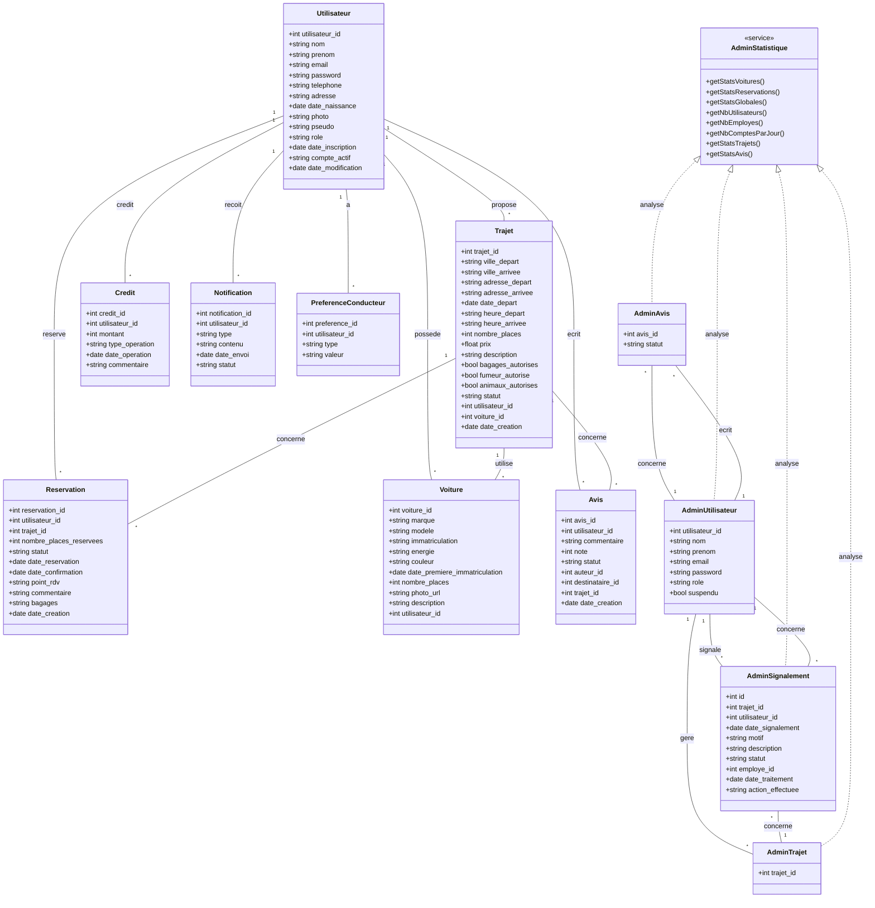

# Diagramme UML des classes PHP (EcoRide)

Ce diagramme Mermaid représente les principales classes PHP du dossier `models/` et leurs attributs.

> Ce diagramme UML permet de visualiser la structure objet du projet, les attributs principaux et les relations entre classes métier.