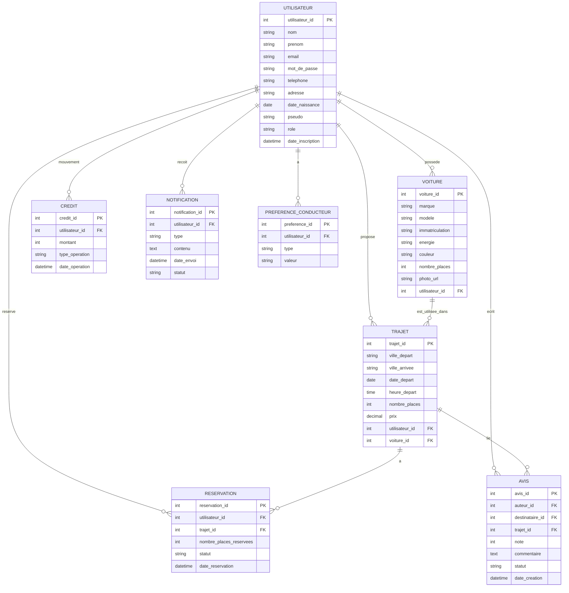

# Diagrammes de la base de données EcoRide

Ce fichier contient des diagrammes Mermaid (MCD/MLD) générés à partir des modèles PHP présents dans `models/`.

## 1) MCD simplifié (Entités & Relations)



## 1) MCD fidèle à la base SQL

```mermaid
erDiagram
    utilisateurs {
        int utilisateur_id PK
        varchar nom
        varchar prenom
        varchar email UNIQUE
        varchar mot_de_passe
        varchar telephone
        text adresse
        date date_naissance
        varchar pseudo UNIQUE
        datetime date_inscription
        enum compte_actif
        enum role
        enum statut
    }
    voiture {
        int voiture_id PK
        varchar modele
        varchar marque
        varchar immatriculation UNIQUE
        varchar energie
        varchar couleur
        date date_premiere_immatriculation
        int nombre_places
        varchar photo_url
        text description
        int utilisateur_id FK
    }
    trajets {
        int trajet_id PK
        varchar ville_depart
        varchar ville_arrivee
        text adresse_depart
        text adresse_arrivee
        datetime date_depart
        time heure_depart
        time heure_arrivee
        int nombre_places
        decimal prix
        text description
        tinyint bagages_autorises
        tinyint fumeur_autorise
        tinyint animaux_autorises
        enum statut
        int utilisateur_id FK
        int voiture_id FK
        datetime date_creation
    }
    reservations {
        int reservation_id PK
        int utilisateur_id FK
        int trajet_id FK
        int nombre_places_reservees
        enum statut
        datetime date_reservation
        datetime date_confirmation
        text point_rdv
        text commentaire
    }
    avis {
        int avis_id PK
        int auteur_id FK
        int destinataire_id FK
        int trajet_id FK
        text commentaire
        int note
        datetime date_creation
        enum statut
        int utilisateur_id
    }
    credits {
        int credit_id PK
        int utilisateur_id FK
        int montant
        enum type_operation
        datetime date_operation
        text commentaire
    }
    notifications {
        int notification_id PK
        int utilisateur_id FK
        enum type
        text contenu
        datetime date_envoi
        enum statut
    }
    preferences_conducteur {
        int preference_id PK
        int utilisateur_id FK
        varchar type
        varchar valeur
        tinyint fumeur_autorise
        tinyint animaux_autorises
        tinyint bagages_volumineux
        tinyint musique_autorisee
        tinyint discussion
        tinyint pauses_prevues
        tinyint climatisation
        tinyint nourriture_autorisee
        varchar type_conduite
        tinyint accessibilite_pmr
    }
    historique_actions {
        int action_id PK
        int utilisateur_id FK
        enum type_action
        int cible_id
        varchar cible_table
        datetime date_action
        text commentaire
        decimal montant
    }
    messages {
        int message_id PK
        int expediteur_id FK
        int destinataire_id FK
        int trajet_id FK
        text contenu
        datetime date_envoi
        tinyint lu
        int utilisateur_id
    }
    signalement {
        int id PK
        int trajet_id FK
        int utilisateur_id FK
        datetime date_signalement
        varchar motif
        text description
        varchar statut
        int employe_id
        datetime date_traitement
        text action_effectuee
    }
    utilisateurs ||--o{ voiture : possede
    utilisateurs ||--o{ trajets : propose
    utilisateurs ||--o{ reservations : reserve
    utilisateurs ||--o{ avis : ecrit
    utilisateurs ||--o{ credits : mouvement
    utilisateurs ||--o{ notifications : recoit
    utilisateurs ||--o{ preferences_conducteur : a
    utilisateurs ||--o{ historique_actions : effectue
    utilisateurs ||--o{ messages : envoie
    utilisateurs ||--o{ signalement : signale
    voiture ||--o{ trajets : transporte
    trajets ||--o{ reservations : a
    trajets ||--o{ avis : concerne
    trajets ||--o{ messages : concerne
    trajets ||--o{ signalement : concerne

## 2) MLD (Tables et clés)

```mermaid
classDiagram
    class utilisateurs {
        +int utilisateur_id PK
        +varchar nom
        +varchar prenom
        +varchar email
        +varchar mot_de_passe
        +varchar telephone
        +varchar adresse
        +date date_naissance
        +varchar pseudo
        +varchar role
        +datetime date_inscription
    }

    class voiture {
        +int voiture_id PK
        +varchar marque
        +varchar modele
        +varchar immatriculation
        +varchar energie
        +varchar couleur
        +int nombre_places
        +varchar photo_url
        +int utilisateur_id FK
    }

    class trajets {
        +int trajet_id PK
        +varchar ville_depart
        +varchar ville_arrivee
        +datetime date_depart
        +time heure_depart
        +int nombre_places
        +decimal prix
        +int utilisateur_id FK
        +int voiture_id FK
    }

    class reservations {
        +int reservation_id PK
        +int utilisateur_id FK
        +int trajet_id FK
        +int nombre_places_reservees
        +varchar statut
        +datetime date_reservation
    }

    class avis {
        +int avis_id PK
        +int auteur_id FK
        +int destinataire_id FK
        +int trajet_id FK
        +int note
        +text commentaire
        +varchar statut
        +datetime date_creation
    }

    class credits {
        +int credit_id PK
        +int utilisateur_id FK
        +int montant
        +varchar type_operation
        +datetime date_operation
    }

    class notifications {
        +int notification_id PK
        +int utilisateur_id FK
        +varchar type
        +text contenu
        +datetime date_envoi
        +varchar statut
    }

    class preferences_conducteur {
        +int preference_id PK
        +int utilisateur_id FK
        +varchar type
        +varchar valeur
    }

    utilisateurs "1" -- "0..*" voiture : possede
    utilisateurs "1" -- "0..*" trajets : propose
    utilisateurs "1" -- "0..*" reservations : reserve
    utilisateurs "1" -- "0..*" avis : ecrit
    trajets "1" -- "0..*" reservations : a
    trajets "1" -- "0..*" avis : lie
    voiture "1" -- "0..*" trajets : est_utilisee_dans

## 2) MLD (Tables et clés fidèles à la base SQL)

```mermaid
classDiagram
    class utilisateurs {
        +int utilisateur_id PK
        +varchar nom
        +varchar prenom
        +varchar email UNIQUE
        +varchar mot_de_passe
        +varchar telephone
        +text adresse
        +date date_naissance
        +varchar pseudo UNIQUE
        +datetime date_inscription
        +enum compte_actif
        +enum role
        +enum statut
    }
    class voiture {
        +int voiture_id PK
        +varchar modele
        +varchar marque
        +varchar immatriculation UNIQUE
        +varchar energie
        +varchar couleur
        +date date_premiere_immatriculation
        +int nombre_places
        +varchar photo_url
        +text description
        +int utilisateur_id FK
    }
    class trajets {
        +int trajet_id PK
        +varchar ville_depart
        +varchar ville_arrivee
        +text adresse_depart
        +text adresse_arrivee
        +datetime date_depart
        +time heure_depart
        +time heure_arrivee
        +int nombre_places
        +decimal prix
        +text description
        +tinyint bagages_autorises
        +tinyint fumeur_autorise
        +tinyint animaux_autorises
        +enum statut
        +int utilisateur_id FK
        +int voiture_id FK
        +datetime date_creation
    }
    class reservations {
        +int reservation_id PK
        +int utilisateur_id FK
        +int trajet_id FK
        +int nombre_places_reservees
        +enum statut
        +datetime date_reservation
        +datetime date_confirmation
        +text point_rdv
        +text commentaire
    }
    class avis {
        +int avis_id PK
        +int auteur_id FK
        +int destinataire_id FK
        +int trajet_id FK
        +text commentaire
        +int note
        +datetime date_creation
        +enum statut
        +int utilisateur_id
    }
    class credits {
        +int credit_id PK
        +int utilisateur_id FK
        +int montant
        +enum type_operation
        +datetime date_operation
        +text commentaire
    }
    class notifications {
        +int notification_id PK
        +int utilisateur_id FK
        +enum type
        +text contenu
        +datetime date_envoi
        +enum statut
    }
    class preferences_conducteur {
        +int preference_id PK
        +int utilisateur_id FK
        +varchar type
        +varchar valeur
        +tinyint fumeur_autorise
        +tinyint animaux_autorises
        +tinyint bagages_volumineux
        +tinyint musique_autorisee
        +tinyint discussion
        +tinyint pauses_prevues
        +tinyint climatisation
        +tinyint nourriture_autorisee
        +varchar type_conduite
        +tinyint accessibilite_pmr
    }
    class historique_actions {
        +int action_id PK
        +int utilisateur_id FK
        +enum type_action
        +int cible_id
        +varchar cible_table
        +datetime date_action
        +text commentaire
        +decimal montant
    }
    class messages {
        +int message_id PK
        +int expediteur_id FK
        +int destinataire_id FK
        +int trajet_id FK
        +text contenu
        +datetime date_envoi
        +tinyint lu
        +int utilisateur_id
    }
    class signalement {
        +int id PK
        +int trajet_id FK
        +int utilisateur_id FK
        +datetime date_signalement
        +varchar motif
        +text description
        +varchar statut
        +int employe_id
        +datetime date_traitement
        +text action_effectuee
    }
    utilisateurs "1" -- "0..*" voiture : possede
    utilisateurs "1" -- "0..*" trajets : propose
    utilisateurs "1" -- "0..*" reservations : reserve
    utilisateurs "1" -- "0..*" avis : ecrit
    utilisateurs "1" -- "0..*" credits : mouvement
    utilisateurs "1" -- "0..*" notifications : recoit
    utilisateurs "1" -- "0..*" preferences_conducteur : a
    utilisateurs "1" -- "0..*" historique_actions : effectue
    utilisateurs "1" -- "0..*" messages : envoie
    utilisateurs "1" -- "0..*" signalement : signale
    voiture "1" -- "0..*" trajets : transporte
    trajets "1" -- "0..*" reservations : a
    trajets "1" -- "0..*" avis : concerne
    trajets "1" -- "0..*" messages : concerne
    trajets "1" -- "0..*" signalement : concerne
```
```

## 3) Notes et recommandations
- Vérifier les noms exacts des tables dans la base (ex: `voitures` vs `voiture`) et ajuster les diagrammes.
- Ajouter les cardinalités précises si la base SQL contient des contraintes (FK, UNIQUE, etc.).
- Exporter ces diagrammes en PNG via un éditeur Mermaid (VSCode + extension, mermaid.live, ou dbdiagram.io) pour le rapport.
