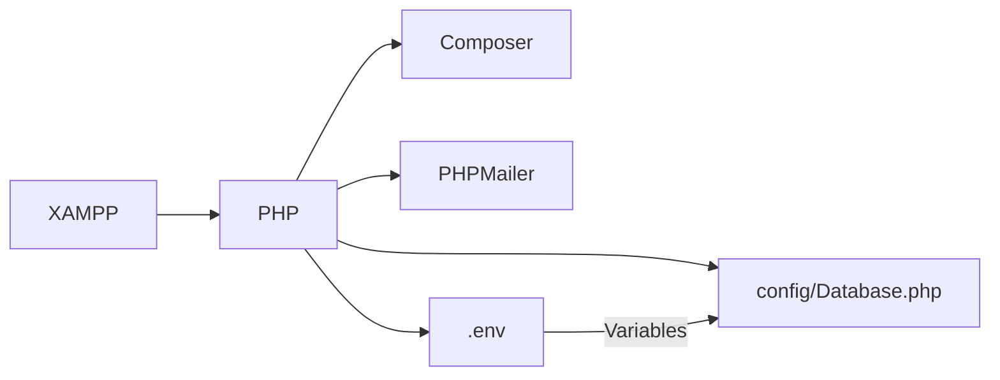
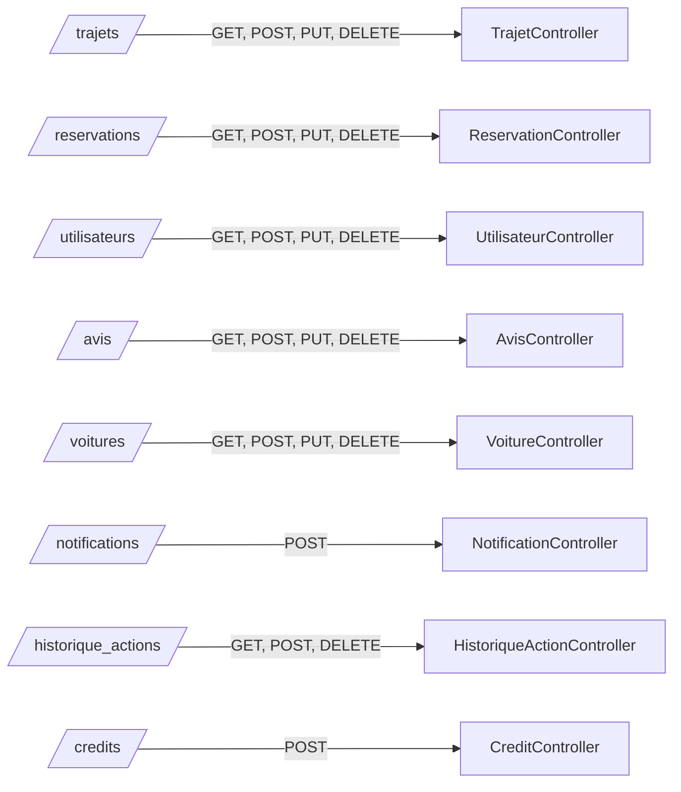
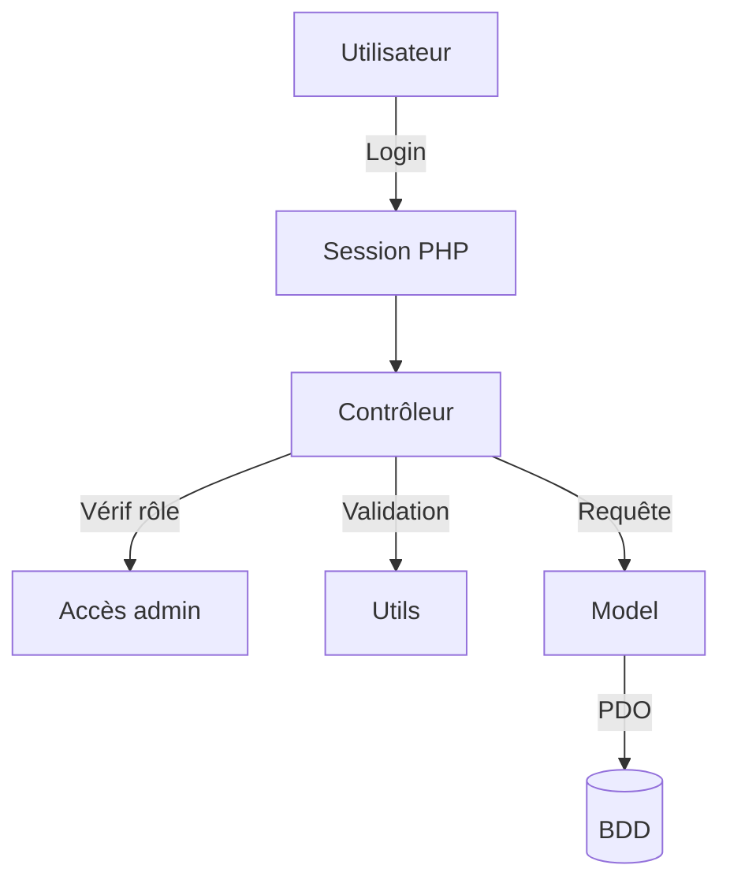
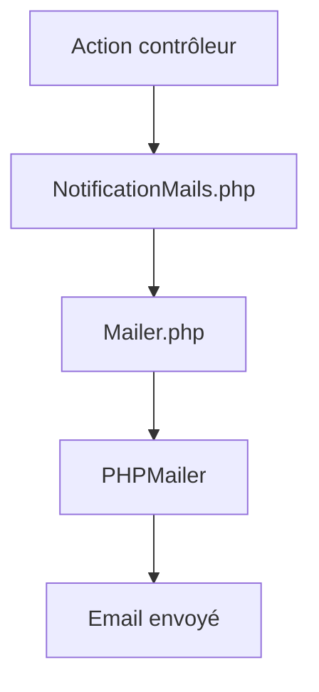
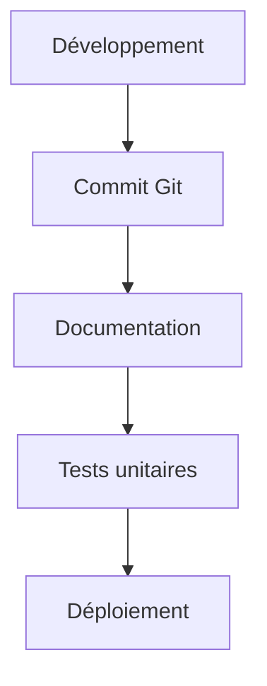

# Documentation technique EcoRide


## 1. Architecture du projet

### Schéma global (Mermaid)
```mermaid
flowchart TD
	A[Client (Web/App)] -->|HTTP| B[API PHP]
	B --> C[Controllers]
	C --> D[Models]
	D --> E[(BDD)]
	C --> F[Utils]
	B --> G[Notifications]
	G --> H[PHPMailer]
	B --> I[Docs]
```

### Modèle MVC
- **Controllers/** : Logique métier, gestion des requêtes HTTP, routage, validation, appels aux modèles.
	- Exemples : `TrajetController.php`, `ReservationController.php`, `UtilisateurController.php`, `AvisController.php`, `VoitureController.php`, `HistoriqueActionController.php`, `CreditController.php`, `NotificationController.php`, etc.
	- Espace admin : `ControllersAdministrateur/TrajetAdminController.php`, `ControllersAdministrateur/UtilisateurAdminController.php`, `ControllersAdministrateur/SignalementAdminController.php`, etc.
- **models/** : Accès aux données, mapping des tables SQL, méthodes CRUD.
	- Exemples : `Trajet.php`, `Reservation.php`, `Utilisateur.php`, `Avis.php`, `Voiture.php`, `Credit.php`, `Notification.php`, `HistoriqueAction.php`, `Dashboard.php`, etc.
	- Espace admin : `ModelAdministrateur/Trajet.php`, `ModelAdministrateur/Utilisateur.php`, `ModelAdministrateur/Signalement.php`, `ModelAdministrateur/Statistique.php`
- **config/** : Configuration BDD, gestion session, headers.
	- Exemples : `Database.php`, `session.php`, `headers.php`
- **Utils/** : Fonctions utilitaires, notifications, mails.
	- Exemples : `NotificationMails.php`, `Mailer.php`
- **docs/** : Documentation, manuel utilisateur, fixtures, technique.
	- Exemples : `manuel_utilisation.md`, `fixtures_documentation.md`, `documentation_technique.md`

### Exemple de code (contrôleur)
```php
// TrajetController.php
require_once '../models/Trajet.php';
$trajetModel = new Trajet($db);
if ($_SERVER['REQUEST_METHOD'] === 'POST') {
	$trajetModel->create($_POST);
	// ...envoi notification, réponse JSON
}
```

### Cas d’usage
- Un utilisateur propose un trajet : le contrôleur reçoit la requête, valide les données, appelle le modèle, puis envoie une notification.
- Un administrateur valide un signalement : le contrôleur admin appelle le modèle admin, puis notifie l’utilisateur concerné.

## 2. Configuration de l’environnement


### Schéma de configuration


### Exemple de configuration SMTP
```php
$mail = new PHPMailer(true);
$mail->isSMTP();
$mail->Host = 'smtp.gmail.com';
$mail->SMTPAuth = true;
$mail->Username = getenv('MAIL_USER');
$mail->Password = getenv('MAIL_PASS');
$mail->SMTPSecure = PHPMailer::ENCRYPTION_STARTTLS;
$mail->Port = 587;
```

### Cas d’usage
- Déploiement sur XAMPP : copier le projet, configurer `config/Database.php`, adapter les variables d’environnement.
- Ajout d’une dépendance : `composer require phpmailer/phpmailer`

## 3. Endpoints API


### Schéma endpoints (Mermaid)


### Exemple d’endpoint (Trajet)
**POST /trajets**
```json
{
	"ville_depart": "Paris",
	"ville_arrivee": "Lyon",
	"date_depart": "2025-10-22",
	"heure_depart": "08:00",
	"nombre_places": 3,
	"prix": 25.0
}
```
**Réponse succès**
```json
{
	"success": true,
	"trajet_id": 123
}
```
**Cas d’erreur**
```json
{
	"success": false,
	"error": "Données invalides"
}
```

#### Paramètres principaux par endpoint
- `/trajets` : ville_depart, ville_arrivee, date_depart, heure_depart, nombre_places, prix
- `/reservations` : utilisateur_id, trajet_id, nombre_places_reservees
- `/utilisateurs` : nom, prenom, email, password, role
- `/avis` : auteur_id, destinataire_id, trajet_id, note, commentaire
- `/voitures` : marque, modele, immatriculation, energie, couleur, nombre_places

#### Réponses et erreurs
- Succès : `{ success: true, ... }`
- Erreur : `{ success: false, error: "..." }`

### Cas d’usage
- Création d’une réservation : POST `/reservations` avec les paramètres, réponse avec l’ID ou erreur.
- Suppression d’un avis : DELETE `/avis/{id}`.

## 4. Sécurité


### Schéma sécurité (Mermaid)


### Exemple de vérification d’authentification
```php
session_start();
if (!isset($_SESSION['user_id'])) {
	http_response_code(401);
	echo json_encode(["error" => "Non authentifié"]);
	exit;
}
```

### Exemple de protection SQL
```php
$stmt = $db->prepare("SELECT * FROM utilisateurs WHERE email = :email");
$stmt->bindValue(':email', $email);
$stmt->execute();
```

### Cas d’usage
- Un utilisateur non connecté tente d’accéder à `/trajets` : réponse 401.
- Un employé accède à l’espace admin : vérification du rôle dans le contrôleur.

## 5. Notifications


### Schéma notifications (Mermaid)


### Exemple d’envoi de notification
```php
require_once '../Utils/NotificationMails.php';
sendReservationNotification($userEmail, $reservationDetails);
```

### Cas d’usage
- Confirmation de réservation : envoi d’un mail à l’utilisateur.
- Signalement traité : notification à l’employé et à l’utilisateur concerné.

## 6. Bonnes pratiques


### Schéma bonnes pratiques (Mermaid)


### Exemple de commit Git
```bash
git commit -m "Ajout de la notification lors de la création de trajet"
```

### Cas d’usage
- Documentation à jour : chaque nouvelle fonctionnalité est documentée dans `docs/`.
- Tests unitaires : création de tests pour les méthodes critiques des modèles.

---


## 7. Modèles principaux et usage

### Exemple : Trajet
```php
class Trajet {
	public function create($data) { /* ... */ }
	public function read($id) { /* ... */ }
	public function update($id, $data) { /* ... */ }
	public function delete($id) { /* ... */ }
}
```
**Usage dans TrajetController.php**
```php
$trajet = new Trajet($db);
$trajet->create($_POST);
```

### Exemple : Reservation
```php
class Reservation {
	public function create($data) { /* ... */ }
	public function read($id) { /* ... */ }
	public function update($id, $data) { /* ... */ }
	public function delete($id) { /* ... */ }
}
```
**Usage dans ReservationController.php**
```php
$reservation = new Reservation($db);
$reservation->create($_POST);
```

### Exemple : Utilisateur
```php
class Utilisateur {
	public function create($data) { /* ... */ }
	public function read($id) { /* ... */ }
	public function update($id, $data) { /* ... */ }
	public function delete($id) { /* ... */ }
}
```
**Usage dans UtilisateurController.php**
```php
$user = new Utilisateur($db);
$user->create($_POST);
```

### Exemple : Notification
```php
class Notification {
	public function send($userId, $message) { /* ... */ }
}
```
**Usage dans NotificationController.php**
```php
$notif = new Notification($db);
$notif->send($userId, $message);
```

---